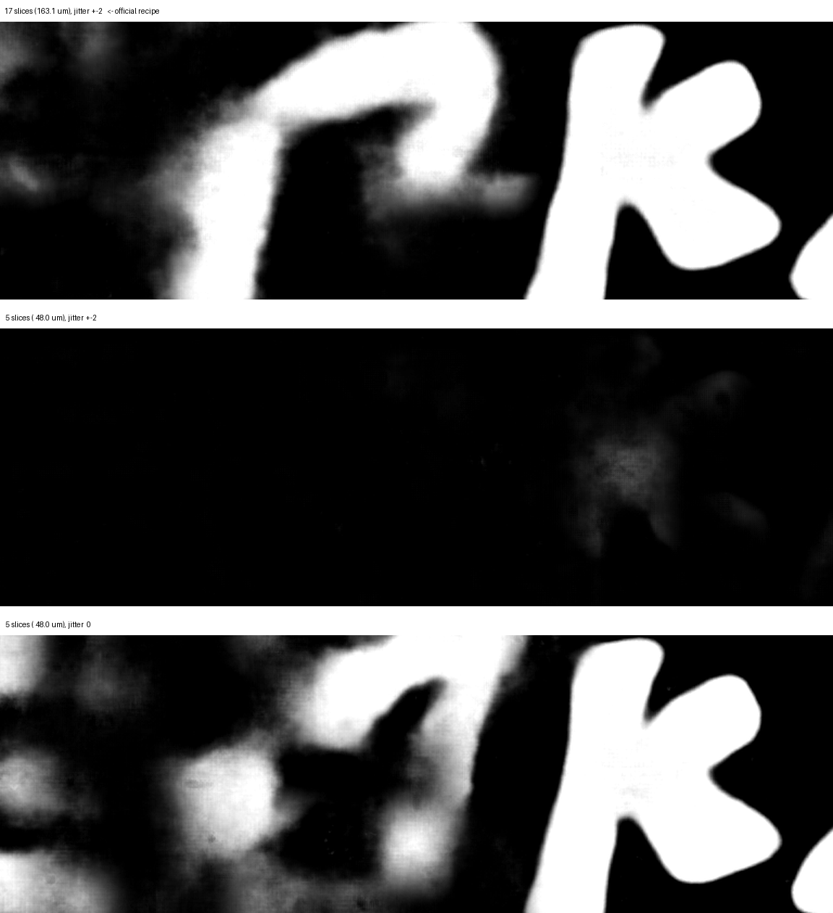

# Five slices are enough at 9 µm — if the jitter shrinks with the window

The released 9 µm recipe samples a 17-slice window of 9.596 µm — 163.1 µm deep —
and jitters it by ±2 slices during training. `err` flagged the number as open on
2026-08-14: *"choosing 17 slices isn't really optimized, it probably isn't the
best number"*, and *"we could be stepping too coarsely, for instance. even more
at 9um"*.

So I measured it. Four arms on the official recipe, one thing changed each time,
300 blind paired comparisons against sealed criteria.

**The window has more than 3× of slack. Five slices are enough — but only if
the jitter shrinks with it.**

| arm | window | jitter | verdict vs. the official 17-slice arm |
|---|---|---|---|
| 13 slices | 124.7 µm | ±2 | **indistinguishable** — 60 ties out of 60 |
| 9 slices | 86.4 µm | ±2 | **indistinguishable** — 60 ties out of 60 |
| 5 slices | 48.0 µm | ±2 | **breaks** — 17-slice wins 58–0, p = 0.0000 |
| 5 slices | 48.0 µm | **0** | **indistinguishable** — 60 ties out of 60 |

The last two rows have **the same window**. The only difference is
`flat_z_window_jitter.max_offset`, 2 against 0.

It was never the depth. It was the jitter.

---

## Why this matters if you train at 9 µm

`max_offset: 2` shifts the window by up to 2 slices no matter how deep it is:

| window | max shift | fraction of the window |
|---|---|---|
| 17 slices | ±2 | 12% |
| 13 slices | ±2 | 15% |
| 9 slices | ±2 | 22% |
| **5 slices** | **±2** | **40%** |

At 40% the augmentation stops being a perturbation and starts changing the
content of the patch. The model trains against a moving target.

**Window depth and z-augmentation are coupled, and the config does not make it
visible.** Shrink the window without shrinking the jitter and you will measure a
degradation and attribute it to depth. That is exactly what the 5-slice arm
alone would have told me.

And the cheap consequence: a 5-slice window with proportional jitter trains at
**5.20 it/s against 3.24** for the 17-slice arm on the same GPU — 60% faster,
4h10 against 6h06 per run, measured with real data.

---

## The numbers

### p99 of the prediction, per segment

How confident the model is on ink pixels. The 5-slice arm collapses where the
signal is hardest, and recovers completely once the jitter is off:

| segment | 17 slices | 5 slices, jitter ±2 | **5 slices, jitter 0** |
|---|---|---|---|
| pherc0139-w039 | 188 | **68** | **174** |
| pherc1667-w013 | 196 | **79** | **193** |
| pherc0814-46527 | 199 | **103** | **200** |
| phercparis4-w00 | 200 | 173 | **200** |
| phercparis4-w02 | 200 | 174 | **201** |
| phercparis4-w03 | 201 | 182 | **201** |

The Paris 4 segments barely suffer while 0139 and 1667 fall apart. That tracks
what `sean` observed on 2026-08-04 — ink is recoverable at 9.6 µm on Paris 4,
while on 1667 the higher resolution was the difference between finding ink and
not. **A narrow window with disproportionate jitter breaks first where the
signal is already weak.**

### The team's own metrics, on the team's own validation regions

Balanced accuracy at threshold 0.5 and rank AUC over the three published
`validation_mask` regions, scored against the **corrected** labels of
2026-08-18. These were **recorded, not used as the criterion** — the verdict
came from the blind judgement, fixed before any measurement.

Difference against the 17-slice arm, per region (w016 / 0814 / w029):

| arm | balanced accuracy | AUC | blind judgement |
|---|---|---|---|
| 13 slices | +0.029 / +0.055 / −0.007 | +0.036 / +0.065 / −0.013 | indistinguishable |
| 9 slices | +0.031 / +0.043 / −0.046 | +0.070 / +0.072 / +0.005 | indistinguishable |
| **5, jitter ±2** | **−0.173 / −0.242 / −0.322** | **−0.189 / −0.289 / −0.220** | **breaks** |
| 5, jitter 0 | −0.088 / +0.015 / −0.133 | −0.062 / +0.025 / −0.089 | indistinguishable |

Seed noise for reference, measured by Domenico Russo on 2026-08-17 between the
released seed42 and seed43 checkpoints at the same step: 0.130 on w016, 0.021
on 0814, 0.072 on w029. Anything below that does not separate from seed.

**Metric and eye disagree on one arm.** The jitter-0 arm loses 0.133 balanced
accuracy on w029 — above that region's noise floor — while the blind judgement
returned 60 ties, most of them because the letters read identically on both
sides rather than because there were no letters. Three readings fit and the
data does not separate them: the metric penalises a map the eye accepts (the
pattern Domenico documented and `err` described, though his AUC agreed with the
eye and mine does not); the effect sits where the windows do not look; or it is
the cost of removing augmentation, which would need a 17-slice jitter-0 control
to isolate.

So: five slices with jitter 0 is **not identical** to seventeen with jitter ±2.
It is **equivalent for reading** across 60 annotated windows, and possibly
slightly worse by the metric. The central finding does not rest on that: the
5-slice arm drops 0.17–0.32 and the jitter-0 arm drops 0.00–0.13 at the same
depth.

---

## Method

**One variable per experiment.** Every config is generated from the 17-slice
baseline and diffed: only `patch_size`, `flat_z_window_jitter`, `description`
and `out_dir` change. The `NetworkFromConfig` dump is identical across all 40
lines of network configuration in every arm — only the stem's `in_channels`
differs.

**The official recipe, unmodified.** `aligned21_hybrid_3d2d`, batch 64, SGD,
fp16, 78,125 iterations, seed 42, scroll quotas 29/22/11/2. One declared
divergence: the 5 native 9.362 µm representations leave the corpus, because
they cannot be re-pooled and would dilute the axis identically in both arms.

**Blind paired judgement, criteria fixed before measuring.** 60 windows of
256×768 px, drawn with a recorded seed before the first run, selected by
surface coverage ≥90% — a criterion **blind to the arm**, since the input is
identical on both sides. The same 60 windows in every experiment, with the A/B
assignment redrawn each round.

What does **not** count as a win, stated in the preregistration: a difference
in contrast, smoothness or rounding without a difference in letter shape or
integrity; no identifiable letter on either side; a very straight stroke
aligned with its neighbours (suspected fibre — `err` and `Blue`, 2026-08-16).

Verdict by two-sided binomial test against p = 0.5, thresholds fixed in the
preregistration.

**Integrity check before reading any result.** A unanimous outcome is exactly
what a file-pairing error produces, so in every arm the two sides' predictions
were compared first: `identical=False` throughout, r between 0.58 and 0.95,
mean |d| of 6 to 18 levels, both sides always at the same step (`ckpt_077500`).

---

## Limits

**One seed per arm.** The criterion called for a second seed on a significant
result. On the 5-slice arm I ran the jitter-0 experiment instead, since
separating the cause was worth more than replicating the effect. **The 5-slice
result is therefore not confirmed on a second seed.**

**One judge.** All 300 comparisons were made by the same person. The protocol is
blind and the criteria explicit, but there is no inter-rater agreement.

**Window memory.** The same 60 windows were judged five times. From the third
round on, memory of the content is likely; by the fifth the judge knew that in
one round the narrow arm had visibly lost. Declared as an expectation bias that
cannot be removed.

**Labels with a known defect.** On 2026-08-18 `err` announced that the
`ink_9um` masks had been uploaded with the alignment pipeline's seam regions
masked off by mistake, and replaced them. **All five arms trained on the earlier
version.** I downloaded the corrected set and compared the full centre slice of
all 51 masks: the median change is **0.0%** — half the segments did not move —
with a mean of +2.5% pulled by a single +21.5% outlier, concentrated on Paris 4.
The defect is **common to every arm** and each comparison is between two models
that saw the same supervision, so a +2.5% difference on some segments does not
invert a 58–0 result nor turn 60 ties into a visible difference. What it does
compromise is comparability with models trained after the fix. The metrics above
use the **corrected** validation masks, which moved least (1 of 3, at most
+1.7%).

**Region-held-out, not segment-held-out.** The windows are spatially distinct
but come from segments seen in training. Nothing here speaks to generalisation
across segments or scrolls.

**The checkpoint is the last one, not the final step.** With
`num_iterations: 78125` and `save_every: 2500`, the trainer writes at multiples
of 2,500, so the last file is 77,500 — 99.2% of training. Identical across all
arms, so the comparisons are clean. Worth knowing when comparing against the
released checkpoints, which follow the same pattern at `save_every: 5000`.

**The axis has a floor at 5 slices.** Below that, the `default` augmentation
preset does not fit: `GaussianBlurTransform` uses `blur_sigma=(0.3, 1.5)` with
`truncate=6`, which produces padding up to 4, and PyTorch's `mode="reflect"`
needs padding strictly smaller than the dimension. At 3 slices a drawn sigma of
1.0 or more exceeds it. Worth knowing before setting up a narrower run, since
the blur is drawn probabilistically and the run can get some way in before it
surfaces.

---

## What is not established

- **Where the optimum is.** I tested 5, 9, 13 and 17. Five slices with
  proportional jitter is indistinguishable from seventeen, not better than it.
- **What the proportional jitter should be.** I tested `max_offset` 0 and 2. A
  value of 1 at 5 slices — 20% of the window — was not tested.
- **Whether removing the jitter costs something elsewhere.** The control that
  would isolate it, 17 slices with jitter 0, was not run.
- **Anything about cross-scroll generalisation.**

---

## One measurement from an earlier axis

Before this one I ran the same protocol on the sub-step operator — combining the
four 2.399 µm sub-planes by `max` instead of `mean`, physically the
`--accum-type` family — and it came back inconclusive. One measurement from it
is worth carrying over, because it cost nothing and saved a bad assumption:

After the recipe's `robust_mad` normalisation, the `max` arm has a **smaller**
tail than `mean` — p99 down 14% to 43% depending on the segment. Raising the
floor as much as the peak makes the MAD grow, and the relative gain is undone.

**Any axis that moves the input intensity distribution competes with that
normalisation.** Measuring the post-normalisation distribution costs minutes and
can tell you not to spend six hours of GPU.

---

## Reproducing

Checkpoints and the full harness are here; the labels and surface volumes come
from the public endpoints. See `scripts/README.md` for the pipeline and
`prereg/` for the five sealed preregistrations with their SHA256 digests.

Everything derives from public data: surface volumes from the open-data S3
bucket, labels from the `scrollprize` Hugging Face bucket, the recipe from
`ScrollPrize/villa`.

---

Paulo S. Camillo, August 2026. Code, figures and results MIT licensed. The
checkpoints derive from Vesuvius Challenge data and models and remain subject to
the terms of those sources.
